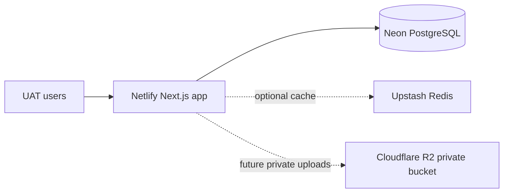

# UAT deployment (Netlify + Neon)

This is a fictional-data UAT environment only. Do not enter real patient, prescription, supplier-finance, or controlled-drug data.



## Branch and build

Deploy the `uat` branch to a dedicated Netlify site. Netlify must use Node 22 and the repository pnpm version. The build command in `netlify.toml` generates Prisma before `pnpm build`; it deliberately does **not** migrate or seed a database.

## Environment variables

Set all runtime values in Netlify; do not commit them. `NEXT_PUBLIC_APP_ENV`, `NEXT_PUBLIC_APP_NAME`, and `NEXT_PUBLIC_APP_URL` are the only client-safe names in `.env.example`.

| Use | Variables |
| --- | --- |
| Runtime / build | `NODE_ENV`, `APP_ENV=uat`, `APP_URL`, `AUTH_SECRET`, `DATABASE_URL`, `REDIS_URL`, `UAT_MODE=true` |
| Migration only | `DIRECT_URL`, `DATABASE_URL`, `APP_ENV=uat`, `UAT_MODE=true` |
| Fictional UAT seed only | `UAT_ADMIN_USERNAME`, `UAT_ADMIN_PASSWORD`, `UAT_PHARMACIST_USERNAME`, `UAT_PHARMACIST_PASSWORD` |
| Optional guarded reset | `UAT_ALLOW_DEMO_RESET=true` and local `UAT_RESET=CONFIRM_TRUNCATE_ALL` |
| Future private R2 upload module | `S3_ENDPOINT`, `S3_REGION`, `S3_BUCKET`, `S3_ACCESS_KEY_ID`, `S3_SECRET_ACCESS_KEY`, `S3_FORCE_PATH_STYLE` |

Neon should provide a pooled `DATABASE_URL` for the hosted app and a direct `DIRECT_URL` for migrations. The current app has no upload implementation, so R2 credentials must not be configured as if uploads already work.

## Release procedure

1. Create an empty Neon UAT database; never clone production data.
2. Configure Netlify server variables and deploy the `uat` branch.
3. From a trusted terminal with the UAT values present, run:

   ```bash
   pnpm db:deploy:uat
   pnpm db:seed:uat
   pnpm db:check:uat
   ```

   The commands reject production mode and localhost targets and print only the database host.
4. Verify `https://YOUR-UAT-SITE/api/health`, login, GRN confirmation, batch-price POS sale, and audit history.

## Security and operations

- The app sends no-index and baseline browser-security headers, and displays a persistent UAT warning after login.
- Session cookies are HttpOnly, SameSite=Lax, and Secure when `APP_URL` is HTTPS.
- PostgreSQL is the authoritative ledger; Redis is optional and health may report `degraded` when it is unavailable.
- No public reset endpoint exists. Use the guarded CLI only for an explicitly approved fictional-data reset.
- The initial `pos.batch.override` permission is granted to the owner role. Grant it to other roles only after UAT approval.

## Free-tier limits and troubleshooting

Neon/Upstash/Netlify free tiers can suspend inactive resources and enforce connection, bandwidth, and execution limits. Re-check `/api/health` after inactivity. If a migration fails, fix the migration and use Prisma's documented `migrate resolve` process—never use `migrate reset` on a shared UAT database.

For a clean teardown, delete the Netlify site, Neon UAT project/database, Upstash UAT database, and the R2 bucket credentials/bucket. Export any fictional test evidence first; no production backup process is defined here.
