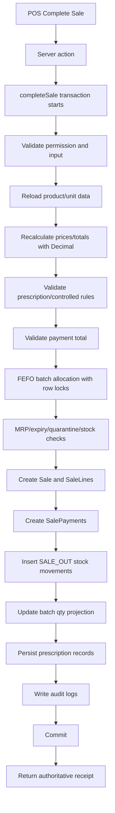

# Milestone 9 — Authoritative Sale Completion

## 1. Purpose

මෙම milestone එකෙන් POS preview-only flow එක real completed sale transaction එකක් බවට පත් වෙයි.

Sale completion එක දැන් එකම authoritative PostgreSQL transaction එකක් තුළ සිද්ධ වෙනවා. ඒ transaction එක stock, payments, prescription records, audit logs, receipt response, සහ sales reports සමඟ සෘජුවම බැඳී තියෙනවා.

මේ නිසා frontend එකෙන් එන preview values හෝ cart allocation guesses trusted source එකක් නෙවෙයි. Server එක තමයි final truth එක.

## 2. Files / modules involved

- `prisma/schema.prisma`
- `prisma/migrations/20260623120000_milestone9_sale_completion_transaction/migration.sql`
- `prisma/seed.ts`
- `src/modules/sales/sale.service.ts`
- `src/modules/sales/sale.actions.ts`
- `src/modules/sales/sale.types.ts`
- `src/modules/sales/sale.service.test.ts`
- `src/components/pos/PosWorkspace.tsx`
- `src/components/pos/PaymentModal.tsx`
- `src/components/pos/ReceiptModal.tsx`
- `src/modules/reports/sales-report.service.ts`
- `src/modules/reports/controlled-drug-report.service.ts`
- `src/app/(app)/dashboard/page.tsx`

## 3. Data model added

Milestone 9 තුළ පහත models සහ enums introduce කළා:

- `Sale`
- `SaleLine`
- `SalePayment`
- `SaleStatus`
- `PaymentMethod`

මේවාගේ අරමුණ මෙන්න:

- `Sale` = sale header record එක
- `SaleLine` = line-level snapshot එකක්, batch-aware allocation detail එකත් එක්ක
- `SalePayment` = cash/card payment persistence එක
- `costPriceAtSale` = historical COGS / gross profit නිවැරදිව හඳුනාගන්න
- `mrpAtSale` = sale වෙලාවේ batch-level MRP proof එක පවත්වාගන්න
- snapshots = පසුකාලීන reporting correctness එක රැකගන්න

## 4. Transaction flow



## 5. Safety rules enforced

Milestone 9 implementation එකෙන් පහත rules enforce වෙනවා:

- stock එක decrease වෙන්නේ միայն `COMPLETED` sale එකකදී
- `HELD` sale එකක් stock deduct කරන්නේ නෑ; current phase එකේ එය safely rejected
- `stock_movements` append-only source of truth ලෙස තියාගන්නවා
- `batches.qty_on_hand_base` cached projection එකක් විතරයි
- negative stock path එකක් allow වෙන්නේ නෑ
- batch decrement කරන්න row locks භාවිතා කරනවා
- medicines සඳහා FEFO allocation ක්‍රියාත්මකයි
- expired / quarantined / depleted batches exclude වෙනවා
- batch-level MRP sale time එකේ check වෙනවා
- backend එක totals නැවත calculate කරනවා
- payment total server-calculated total එකට exactly match විය යුතුයි
- prescription persistence sale complete වුණාට පස්සෙයි
- audit logs same transaction එක තුළ ලියනවා

## 6. Audit actions

Milestone 9 transaction path එකේදී පහත audit actions use වෙනවා:

- `sale.completed`
- `stock.sale_out`
- `payment.recorded`
- `prescription.captured`
- `prescription.skipped`
- `controlled_drug.sale_validated`

Safety hardening pass එකෙන් මේ audit rows prove කරන tests ද add කළා.

## 7. Reports unlocked

Milestone 9 නිසා පහත reports real completed-sale data භාවිතා කරනවා:

- daily sales report = completed `Sale` rows
- cash/card report = `SalePayment` rows
- product-wise sales = `SaleLine` rows
- gross profit = `SaleLine.costPriceAtSale`
- controlled drug register = completed sale-backed prescription data
- dashboard = completed-sale metrics

මේකෙන් preview-only numbers හෝ current stock cost එක history එකට mix වෙන්නේ නෑ.

## 8. Tests added / verified

Safety review සහ hardening pass එකේදී පහත scenarios verify කළා:

- normal OTC sale creates `Sale`, `SaleLine`, `SalePayment`, `SALE_OUT` movement
- audit rows exist for sale/payment/stock
- completed sale decrements batch qty
- payment mismatch rejects and rolls back stock
- insufficient stock rejects and creates no sale/payment/movement
- expired medicine batch is not allocated
- quarantined batch is not allocated
- medicine price above batch MRP rejects
- FEFO picks nearest expiry batch
- multi-batch FEFO split works
- controlled drug without patient/prescriber rejects
- controlled drug with valid details succeeds
- `PrescriptionSaleLine` links real `SaleLine` rows
- controlled audit assertions exist
- gross profit uses `costPriceAtSale`

## 9. Verification commands

```bash
node node_modules/prisma/build/index.js generate
node node_modules/typescript/bin/tsc --noEmit
corepack pnpm lint
corepack pnpm test
corepack pnpm build
```

Final verified result:

- `Prisma generate` ✅
- `TypeScript` ✅
- `ESLint` ✅
- `Tests` ✅ 24/24 passed
- `Build` ✅

## 10. Remaining risks before real pharmacy UAT

Milestone 9 complete වුණත් real pharmacy UAT එකට පෙර තව බලන්න ඕනෑ points:

- concurrent checkout stress test එක real DB load එකකින්
- production seed / role validation after deploy
- batch row contention monitoring
- POS UI live browser smoke test for server errors
- receipt print styling තව implement කරලා නැහැ
- sale void / refund තව implement කරලා නැහැ
- expenses / supplier payments තව implement කරලා නැහැ
- day-end / Z-report තව implement කරලා නැහැ
- prescription image upload තව implement කරලා නැහැ

## 11. Next milestones

Recommended order:

1. M10 Expenses + Supplier Payments
2. M11 Sale Void / Refund + Write-off / Adjustment
3. M12 Day-end / Z-report + Receipt Printing
4. M13 Production Hardening + UAT

## 12. Final verdict

Milestone 9 complete සහ safety-reviewed.

System එක දැන් real authoritative sale transaction path එකකට යොමු වෙලා තියෙනවා. POS preview එක final truth එක නෙවෙයි; server transaction එක final truth එක.

Real pharmacy pilot එකකට යන්න පෙර UAT සහ receipt/error smoke testing එකක් තව recommended.

Next coding milestone එක M10 විය යුතුයි, new sale logic එක නෙවෙයි.
