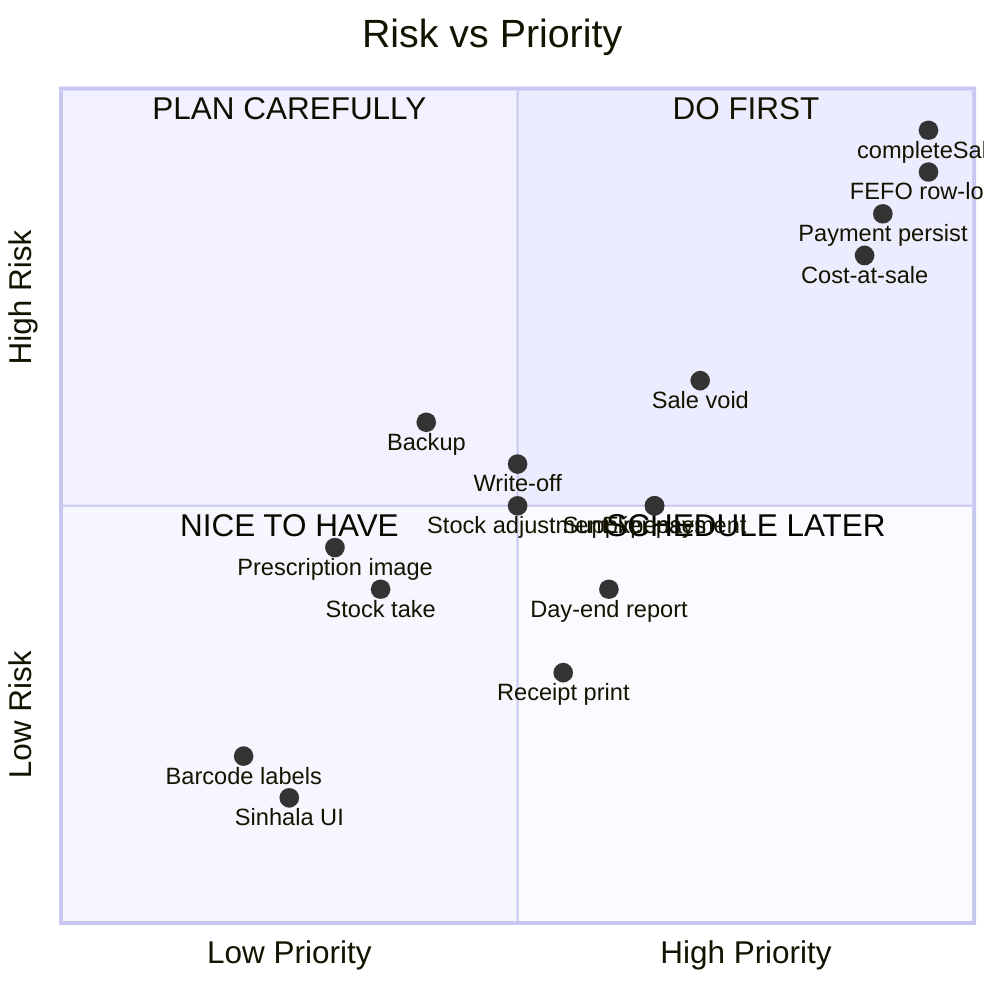

# ඊළඟ වැඩ Brainstorm — එහෙළියගොඩ ෆාමසි ERP/POS

> **අවසන් යාවත්කාලීනය:** 2026-06-23  
> **ව්‍යාපෘතිය:** MediSquare Pharmacy Clinic ERP  
> **විෂය පථය:** Prioritized improvement list — real pharmacy operations perspective  

---

## Prioritized Brainstorm List

| # | Priority | Idea / Improvement | ෆාමසියට ඇයි වැදගත්ද | Build Milestone | Risk | Data Model Change? |
|---|----------|--------------------|-----------------------|----------------|------|-------------------|
| 1 | 🔴 P0 | **Authoritative `completeSale()` transaction** | Counter එකේ sale එකක්වත් process කළ නොහැක — system හි හදවත මෙයයි. `Sale`, `SaleLine`, `SalePayment` create + stock deduction + audit = **single PostgreSQL transaction**. | **M9** | 🔴 Critical | ✅ NEW: `Sale`, `SaleLine`, `SalePayment` tables |
| 2 | 🔴 P0 | **FEFO batch allocation with row-lock transaction** | Medicine dispense කිරීමේදී expire වෙන්නට ආසන්නතම batch එකෙන් ගත යුතුයි. Row lock (`SELECT ... FOR UPDATE`) + multi-batch allocation loop essential. Concurrent sales not oversell. | **M9** | 🔴 Critical | ❌ Existing `Batch` + `StockMovement` tables sufficient |
| 3 | 🔴 P0 | **`SALE_OUT` stock movement creation** | Sale complete වූ විට `stock_movements` ledger එකට append-only `SALE_OUT` record. Source of truth update. `batches.qty_on_hand_base` decrement. | **M9** | 🔴 Critical | ❌ `StockMovementType.SALE_OUT` already in enum |
| 4 | 🔴 P0 | **Payment persistence (`SalePayment` model)** | Cash/card/split payments DB record. Day-end reconciliation impossible otherwise. | **M9** | 🔴 Critical | ✅ NEW: `SalePayment` table |
| 5 | 🔴 P0 | **Cost-at-sale snapshot (`SaleLine.costPriceAtSale`)** | Gross profit report ට sale-time cost price mandatory. Future batch cost changes historical profit distort කරයි. **Never use current batch cost for historical COGS.** | **M9** | 🔴 Critical | ✅ NEW: `SaleLine.costPriceAtSale` column |
| 6 | 🔴 P0 | **Prescription persistence inside sale transaction** | Controlled drug → patient + prescriber records must commit **only if sale completes**. `persistPrescriptionForCompletedSale()` ready to plug in. | **M9** | 🔴 Critical | ❌ `Prescription`, `PrescriptionSaleLine` already exist |
| 7 | 🔴 P0 | **MRP ceiling re-verification at sale time** | GRN confirm එකේ check කළත්, sale time එකේ **re-verify** කළ යුතුයි. Batch MRP corrected after GRN confirm possibility. | **M9** | 🔴 Critical | ❌ No change — validation logic only |
| 8 | 🔴 P0 | **Final receipt response from `completeSale()`** | Server-authoritative receipt data. Sale number, line allocations, payment breakdown, timestamp. `ReceiptModal` real data show කරයි. | **M9** | 🟡 Medium | ❌ Response shape only |
| 9 | 🟡 P1 | **Sale void/refund flow** | Customer return, wrong sale, pharmacist error — void mechanism. `RETURN_IN` or `WRITE_OFF` decision. Sale status → VOIDED. | **M11** | 🟡 Medium | ✅ NEW: `SaleVoid` or void fields on `Sale` |
| 10 | 🟡 P1 | **Return-to-stock vs write-off decision on void** | Void කළ sale එකේ medicine ආපසු stock ට ගන්නවාද, write-off කරනවාද? Per-line decision. | **M11** | 🟡 Medium | ✅ Per-return-line `returnToStock` boolean |
| 11 | 🟡 P1 | **Expense model + CRUD** | Electricity, rent, transport costs track කිරීම. **Supplier payments ≠ expenses.** | **M10** | 🟡 Medium | ✅ NEW: `Expense` table |
| 12 | 🟡 P1 | **Supplier payment recording** | Supplier invoice ට ගෙවීම record. `SupplierInvoice.paidAmount` update + status transition. | **M10** | 🟡 Medium | ✅ NEW: `SupplierPayment` table |
| 13 | 🟡 P1 | **Day-end / Z-report** | Cash drawer count vs system total. Daily summary — cash, card, expenses, opening/closing balance. | **M12** | 🟡 Medium | ✅ NEW: `DayEndReport` table |
| 14 | 🟡 P1 | **Receipt printing (thermal printer)** | 58mm/80mm thermal printer ට print-ready CSS. `window.print()` or direct print API. | **M12** | 🟢 Low | ❌ CSS/print template only |
| 15 | 🟡 P1 | **Expired stock write-off flow** | Expired batch → write-off. `WRITE_OFF` stock movement. Batch status → DEPLETED if fully written off. | **M10** or **M11** | 🟡 Medium | ❌ Enum exists; service logic needed |
| 16 | 🟡 P1 | **Stock adjustment flow** | Physical count mismatch → ADJUSTMENT movement. Audit with before/after qty. | **M10** or **M11** | 🟡 Medium | ❌ Enum exists; service logic needed |
| 17 | 🟡 P1 | **Card reference mandatory enforcement for CARD payments** | Day-end card reconciliation ට card reference number essential. Server-side mandatory validation. | **M9** | 🟢 Low | ❌ Validation logic only |
| 18 | 🟡 P1 | **Controlled drug register export (CSV/PDF)** | NMRA inspection ට controlled drug dispensing history export. Printable format. | **M12** or **M13** | 🟢 Low | ❌ Read-only query + export format |
| 19 | 🟡 P2 | **Stock take / physical inventory count** | පවතින stock එක physically count කර system එකට reconcile. Batch-level count entry. | **M13** | 🟡 Medium | ✅ NEW: `StockTake`, `StockTakeLine` tables |
| 20 | 🟡 P2 | **Dashboard alerts (low stock, near-expiry, pending payables)** | Dashboard එකේ real-time alerts. Badge counts. Click-through to detail. | **M12** or **M13** | 🟢 Low | ❌ Read query aggregation |
| 21 | 🟡 P2 | **Low stock reorder level helper** | Low stock products list → suggested reorder quantities. Supplier-linked reorder suggestion. | **M13** | 🟢 Low | ❌ `Product.reorderLevel` + `reorderQty` already exist |
| 22 | 🟡 P2 | **Near-expiry alert notifications** | 30/60/90 day expiry thresholds. Dashboard prominent display. Configurable threshold. | **M12** or **M13** | 🟢 Low | ⚠️ `SystemSetting` for threshold config |
| 23 | 🟡 P2 | **Audit viewer advanced filters** | Action type filter, entity type filter, date range, actor filter. Current viewer has basic search/filter. | **M13** | 🟢 Low | ❌ Query improvements only |
| 24 | 🟡 P2 | **Data backup automation** | PostgreSQL pg_dump scheduled backup. Local + offsite. Restore test procedure. | **M13** | 🟡 Medium | ❌ Infrastructure/ops only |
| 25 | 🟡 P2 | **Role permission review + additional roles** | Current: OWNER_DOCTOR, PHARMACIST_CASHIER. Future: JUNIOR_CASHIER (no controlled drugs), VIEWER (reports only). | **M13** | 🟢 Low | ❌ Seed data change only |
| 26 | 🟡 P2 | **User activity report** | User-wise sale count, GRN count, login activity. Accountability tracking. | **M13** | 🟢 Low | ❌ Audit log aggregation query |
| 27 | 🟡 P2 | **Manual batch override audit** | Pharmacist FEFO override කළ විට audit log. Professional judgment justification. | **M9** or **M11** | 🟢 Low | ❌ Audit log action + optional batchId param |
| 28 | 🟡 P2 | **Price/MRP change audit** | Product default selling price හෝ batch MRP change → audit log with before/after values. | **M10** or **M13** | 🟢 Low | ❌ Audit log in update service |
| 29 | 🟡 P2 | **Dev seed/demo data cleanup** | Seed data with realistic near-expiry dates, multiple batches, varied prices. UAT-friendly test data. | **M9** (before) | 🟢 Low | ❌ `prisma/seed.ts` update only |
| 30 | 🟡 P2 | **Production environment checklist** | `.env.production` template. PostgreSQL production config. Redis production config. SSL/HTTPS. Domain setup. | **M13** | 🟡 Medium | ❌ Infrastructure docs |
| 31 | 🟡 P2 | **UAT checklist for real pharmacy counter** | Step-by-step test script. Real products. Real supplier GRN. Multiple sale types. Day-end reconciliation. Controlled drug sale. | **M13** | 🟡 Medium | ❌ Test documentation |
| 32 | 🟡 P2 | **Barcode label printing** | Product barcode labels print කිරීම for products without manufacturer barcodes. Zebra/Brother label printer. | **Phase 2** | 🟢 Low | ❌ Print template only |
| 33 | 🟡 P2 | **Prescription image upload** | Prescription photo capture/upload. S3/local storage. Access control. `prescription_image.viewed` audit. | **Phase 2** | 🟡 Medium | ⚠️ File storage infrastructure |
| 34 | 🟢 P3 | **Held sale support** | Sale hold → resume flow. Customer items select කළ නමුත් මුදල් ගෙන්නට යයි. | **M9** (optional) or **M12** | 🟢 Low | ⚠️ `Sale` with `HELD` status + resume logic |
| 35 | 🟢 P3 | **Sinhala UI labels** | Button, header, receipt labels in Sinhala. i18n framework or simple label map. | **M13** | 🟢 Low | ❌ UI text changes only |
| 36 | 🟢 P3 | **Batch qty projection reconciliation tool** | `batches.qty_on_hand_base` vs `SUM(stock_movements)` compare. Admin-only. Alert on mismatch. | **M13** | 🟡 Medium | ❌ Read-only query + correction via ADJUSTMENT |
| 37 | 🟢 P3 | **GRN cancel/edit after draft** | DRAFT GRN edit lines. Cancel DRAFT GRN. (CONFIRMED cannot be reversed — only void via adjustment.) | **M11** or **M13** | 🟢 Low | ⚠️ GRN status transition: DRAFT → CANCELLED |
| 38 | 🟢 P3 | **Category master table** | Free-text `Product.category` → proper `Category` table with predefined values. | **M13** | 🟢 Low | ⚠️ NEW: `Category` table + FK |
| 39 | 🟢 P3 | **`ipAddress` / `userAgent` capture in audit logs** | Server action වලින් IP + UA pass to `writeAuditLog()`. Forensic attribution improvement. | **M9** or **M13** | 🟢 Low | ❌ Already in schema; populate in service |
| 40 | 🟢 P3 | **`SupplierInvoice.dueDate` field** | Credit term based due date. Overdue payables alert. | **M10** | 🟢 Low | ⚠️ NEW: `dueDate` column on `SupplierInvoice` |

---

## Priority Legend

| Symbol | Meaning | Timeline |
|--------|---------|----------|
| 🔴 P0 | **Blocker** — system එක operate කළ නොහැක මෙය නැතිව | Immediate — Milestone 9 |
| 🟡 P1 | **High** — first month operations ට අවශ්‍යයි | Milestones 10–12 |
| 🟡 P2 | **Medium** — production readiness ට අවශ්‍යයි | Milestone 13 / Phase 2 |
| 🟢 P3 | **Nice to have** — quality of life improvement | Phase 2+ |

---

## Milestone 9 ට පෙර කළ යුතු (Pre-Milestone 9 Checklist)

- [ ] Dev seed data update: near-expiry test batch (30 days), multiple batches per product
- [ ] Integration contract review: `FutureCompleteSaleInput` shape finalize
- [ ] `Sale`, `SaleLine`, `SalePayment` Prisma schema design review
- [ ] FEFO allocation algorithm pseudo-code review
- [ ] Row lock strategy document (batch-level `SELECT ... FOR UPDATE`)
- [ ] `costPriceAtSale` snapshot strategy confirm
- [ ] Payment exact-match validation strategy confirm (card reference mandatory?)
- [ ] Prescription integration point verify: `validateAndPersistPrescriptionForCompletedSale()` still correct?
- [ ] Test plan: unit tests, integration tests, concurrent sale tests

## Milestone 9 ට පසු කළ යුතු (Post-Milestone 9 Checklist)

- [ ] Sales reports verify: daily, cash/card, product-wise, gross profit
- [ ] Controlled drug register verify: populated with completed sales
- [ ] Dashboard real data verify
- [ ] Receipt response verify: correct amounts, allocations, prescription data
- [ ] Concurrent sale stress test
- [ ] Float vs Decimal boundary audit (UI cart → server-side recalculation)
- [ ] Audit log completeness check: sale.completed, payment.recorded, stock_movement.sale_out
- [ ] UAT at pharmacy counter with pharmacist feedback

---

## Risk Heat Map

