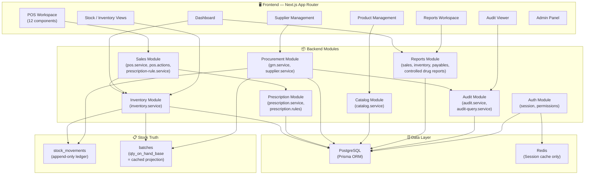

# ව්‍යාපෘති දෘශ්‍ය සැලැස්ම — එහෙළියගොඩ ෆාමසි ERP/POS

> **අවසන් යාවත්කාලීනය:** 2026-06-23  
> **ව්‍යාපෘතිය:** MediSquare Pharmacy Clinic ERP  
> **Stack:** Next.js App Router · TypeScript · PostgreSQL · Prisma · Redis · Modular Monolith  
> **Branch model:** Single-branch  

---

## A. වත්මන් ව්‍යාපෘති තත්ත්වය

| # | Milestone | ඉලක්කය | වත්මන් තත්ත්වය | කේතයෙන්/docs වලින් සාක්ෂි | ඉතිරි අවදානම |
|---|-----------|---------|-----------------|--------------------------|--------------|
| 1 | Foundation | Next.js App Router, Prisma, PostgreSQL, Redis, project structure | ✅ Done | `package.json`: Next 15, Prisma 6, Redis 6, Zod 4. `src/lib/prisma.ts`, `src/lib/redis.ts`, `src/lib/env.ts` පවතී. `tsconfig.json` path aliases හරි. | Redis භාවිතය අවම — stock truth එක PostgreSQL මත පමණි. නිවැරදි තීරණයක්. |
| 2 | Auth + RBAC | JWT session, Role/Permission, guards | ✅ Done | `User`, `Role`, `Permission`, `RolePermission` models schema.prisma හි. `session.ts`: JWT (jose), httpOnly cookie. `permissions.ts`: `requirePermission`, `requireRole`, `requireAuth`. Seed script: `OWNER_DOCTOR`, `PHARMACIST_CASHIER` roles + 12 permissions. | Session expiry 7 දින — production එකේ refresh mechanism නැත. `ipAddress`/`userAgent` audit log හි capture වෙයි නමුත් `writeAuditLog` call sites එයට pass නොකරයි (partial). |
| 3 | Catalog | Product, ProductUnit, ProductBarcode, prescriptionRule, isControlled | ✅ Done | `Product` model: `name`, `genericName`, `strength`, `form`, `productType` (MEDICINE/GENERAL_ITEM), `prescriptionRule` (NONE/PROMPT_SKIPPABLE/HARD_REQUIRED_CONTROLLED), `isControlled`, `isSpecialDrug`, `defaultSellingPrice`, `reorderLevel`. `ProductUnit`: multi-unit support + `factorToBase`. `ProductBarcode`: unique barcode, manufacturer type. Seed: Paracetamol, Amoxicillin, Diazepam (controlled), Disposable Mask. | `category` field free-text — category master table නැත. UI edit/delete flow `product-form.tsx` + `actions.ts` හි. |
| 4 | Direct GRN | GRN draft → confirm → batch + stock_movement + supplier invoice | ✅ Done | `Grn`, `GrnLine`, `Supplier`, `SupplierInvoice` models. `grn.service.ts`: `createGrnDraft` + `confirmGrn` = full transactional confirm: batch create, `GRN_IN` stock movement, supplier payable, audit log — **එකම transaction එකේ**. Row lock: `SELECT ... FOR UPDATE`. Medicine validation: batchNo, expiryDate, MRP required; `sellingPrice <= mrp` enforced. `GrnStatus`: DRAFT → CONFIRMED. | GRN cancel/edit/void flow නැත — DRAFT confirm කළාම ආපසු ගත නොහැක. `invoiceTotal` GRN-line-level cost × qty ලෙස server-side calculate වෙයි. |
| 5 | Inventory | Batch, StockMovement, FEFO read, summary, expiry alerts | ✅ Done | `Batch` model: `qtyOnHandBase` (cached projection), `status` (ACTIVE/QUARANTINED/DEPLETED). `StockMovement`: append-only ledger, `movementType` enum (GRN_IN, SALE_OUT, RETURN_IN, WRITE_OFF, ADJUSTMENT). `inventory.service.ts`: stock summary, batch list, movement list, expiry alerts (90-day default). FEFO sort: `sellableBatches()` in `pos.service.ts`. | Write-off/adjustment service logic නැත — enum values exists but no service implementation. `qtyOnHandBase` projection reconciliation tool නැත. |
| 6 | POS + Payments UI/read flow | Product search, barcode lookup, cart, unit selector, batch preview, payment modal, prescription modals | ✅ Done | `pos.service.ts`: `searchProductsForPos`, `lookupProductByBarcode`, `getProductUnits`, `getPosBatchPreview`. `pos.types.ts`: `PosCartLine`, `PosPaymentInput`, `PosReceiptPreview`. `pos.utils.ts`: cart line create/update, totals, payment matching, receipt preview. 12 POS components: `PosWorkspace`, `CartTable`, `CartLine`, `BarcodeInput`, `ProductSearchPanel`, `BatchPreviewCard`, `PaymentModal`, `ControlledDrugModal`, `PrescriptionPromptModal`, `ReceiptModal`, `PosSummaryPanel`, `UnitSelectorModal`. | **Cart line `unitPrice` / `lineTotal` JS `number` ලෙස — floats!** `roundMoney()` workaround පවතියි නමුත් authoritative calculation server-side Decimal වලින් සිදුවිය යුතුය (Milestone 9 එකේ). POS UI `completeSale` action එකක් call නොකරයි — preview-only. |
| 6.5 | Dummy data cleanup / real read models | Seed data realistic, no mock sales | ✅ Done | Seed script: 4 products, proper units+barcodes, 1 confirmed GRN, real stock movements. Sales report services: honest `"unavailable"` return. No dummy Sale/SaleLine/Payment rows. `integration-contract-phase-3-6.md` doc. | Dev seed data has long-dated expiry (2027) — UAT ට near-expiry test data අවශ්‍යයි. |
| 7 | Prescription + Controlled Drug Rules | Prescription validation, persistence for future sale, PrescriptionSaleLine | ✅ Done | `Prescription`, `PrescriptionSaleLine`, `Patient` models. `prescription.rules.ts`: pure validator — NONE/PROMPT_SKIPPABLE/HARD_REQUIRED_CONTROLLED. Controlled drugs: patient name + identifier + prescriber name + reference **mandatory**. Skip reason required for PROMPT_SKIPPABLE. `prescription.service.ts`: `persistPrescriptionForCompletedSale` — designed to run **inside future sale transaction** only. Audit log per prescription action. Unit tests: `prescription.rules.test.ts`. | `imageKey` optional for MVP. `Prescription.saleId` future UUID reference — Sale model not yet. |
| 8 | Reports + Audit | Report catalog, honest availability, paginated audit viewer | ✅ Done | 11 report types in `report.types.ts`. Inventory reports (stock valuation, low stock, near expiry, expired/quarantined) **Available**. Sales reports — honest `"unavailable"`. Expenses — `"unavailable"`. Supplier payables — **Available**. Controlled drug register — audited view, `"unavailable"` until Sale. Audit viewer: paginated, search/filter. `milestone-8-reports-audit.md` doc with manual test checklist. | Expense report type defined but no model. CSV export intentionally disabled. |
| 9 | Authoritative Sale Completion | Sale, SaleLine, SalePayment, completeSale, FEFO stock-out, cost-at-sale | 🔴 Pending | Type definitions exist (`SaleStatus`, `PaymentMethod` in pos.types.ts), `FutureCompleteSaleInput` in integration contract, prescription service ready to plug in. | **මෙය ඊළඟ ප්‍රධාන milestone එක — data models, transaction logic, stock deduction යන සියල්ල build කළ යුතුයි.** |

---

## B. වත්මන් ගෘහ නිර්මාණ සිතියම

### ප්‍රධාන ගෘහ නිර්මාණ නීති (Hard Rules)

| # | නීතිය | කේතයේ බලාත්මක කිරීම |
|---|--------|---------------------|
| 1 | Inventory is batch-level | `Batch` model → `qtyOnHandBase` per batch |
| 2 | `stock_movements` append-only ledger = source of truth | `StockMovement` model, `confirmGrn()` writes `GRN_IN` |
| 3 | `batches.qty_on_hand_base` = cached projection only | `confirmGrn()` sets initial value; future `completeSale()` must decrement |
| 4 | Stock increases only on confirmed GRN | `confirmGrn()` → `GRN_IN` movement inside transaction |
| 5 | Stock decreases only on COMPLETED sale | **Not yet implemented** — Milestone 9 |
| 6 | PO never moves stock | No PO model exists; GRN is direct |
| 7 | FEFO for medicines | `sellableBatches()` sorts by `expiryDate` ascending |
| 8 | Medicine sale price ≤ batch-level MRP | `confirmGrn()` enforces `sellingPrice <= mrp`; sale completion must re-verify |
| 9 | Expired/quarantined batches cannot be sold | `sellableBatches()` filters: `ACTIVE` + `expiryDate >= today` |
| 10 | No negative stock; DB transaction + row locks | `confirmGrn()` uses `FOR UPDATE`; sale must do same |
| 11 | Decimal-compatible values, never floats | `Prisma.Decimal` everywhere in services. **UI cart uses JS number — preview only** |
| 12 | Controlled drugs: patient + identifier + prescriber + reference | `prescription.rules.ts` validates mandatory fields |
| 13 | Prescription image upload = Phase 2 | `imageKey` optional in schema |
| 14 | Supplier payments ≠ expenses | `payables-report.service.ts` explicitly separates |
| 15 | No full double-entry GL in MVP | No GL model; operational finance only |
| 16 | All mutations → audit log in same transaction | `writeAuditLog()` accepts transaction client |

---

## C. ඉතිරි Build Roadmap

---

### Milestone 9: Authoritative Sale Completion 🔴 ඊළඟ

**ඉලක්කය:** POS cart එකේ items DB transactions තුළ stock deduct කර, payment persist කර, prescription save කර, receipt respond කිරීම.

#### Data Model Impact
- **NEW** `Sale` table: `id`, `saleNo`, `status` (HELD/COMPLETED/VOIDED), `subtotal`, `discountAmount`, `taxAmount`, `total`, `completedAt`, `createdById`
- **NEW** `SaleLine` table: `id`, `saleId`, `productId`, `batchId`, `unitId`, `qtyInUnit`, `qtyBase`, `unitPrice`, `lineTotal`, `costPriceAtSale`, `mrpAtSale`
- **NEW** `SalePayment` table: `id`, `saleId`, `method` (CASH/CARD), `amount`, `cardReference`
- **MODIFY** `Prescription.saleId` → foreign key to `Sale.id`
- **MODIFY** `PrescriptionSaleLine.saleLineId` → foreign key to `SaleLine.id`

#### Service Logic
- `completeSale(input, actorUserId)` — single PostgreSQL transaction:
  1. Validate products, units, prices, prescription requirements
  2. FEFO batch allocation with `SELECT ... FOR UPDATE` row locks
  3. Verify `sellingPrice <= batch.mrp` per medicine batch
  4. Verify no expired/quarantined/zero-stock batches
  5. Create `Sale` (status=COMPLETED), `SaleLine` rows (with `costPriceAtSale` snapshot)
  6. Create `SALE_OUT` stock movements per batch allocation
  7. Decrement `batches.qty_on_hand_base` — **check ≥ 0 inside transaction**
  8. Create `SalePayment` rows — verify sum = `sale.total`
  9. Call `validateAndPersistPrescriptionForCompletedSale()` if applicable
  10. Write audit log(s) in same transaction
  11. Return receipt-ready response

#### UI Impact
- `PosWorkspace.tsx`: "Complete Sale" button → call `completeSaleAction`
- `ReceiptModal.tsx`: show authoritative receipt from server response
- `PaymentModal.tsx`: enforce exact total match, card reference requirement

#### Reports Impact
- Sales reports (daily, cash/card, product-wise, gross profit) → **Available**
- Controlled drug register → **Available**
- Dashboard summary → real daily totals

#### Tests Needed
- Unit: FEFO allocation logic, price/MRP validation, payment sum matching
- Integration: full `completeSale` transaction with rollback on insufficient stock
- Edge cases: concurrent sales on same batch, last-unit depletion

#### Risk Level: 🔴 High
- මෙය system එකේ **හදවත** — money + stock truth එකට ස්පර්ශ කරයි
- Transaction isolation + row locking critical
- Float vs Decimal boundary bugs

---

### Milestone 10: Expenses + Supplier Payments — Operational Finance 🟡

**ඉලක්කය:** Day-to-day operational expenses (electricity, rent, etc.) සහ supplier invoice payments track කිරීම. **Sale completion එකට මිශ්‍ර නොකරන්න.**

#### Data Model Impact
- **NEW** `Expense` table: `id`, `expenseNo`, `date`, `category`, `description`, `amount`, `paymentMethod` (CASH/CARD), `reference`, `createdById`
- **NEW** `SupplierPayment` table: `id`, `supplierInvoiceId`, `amount`, `paymentMethod`, `reference`, `paidAt`, `createdById`
- **MODIFY** `SupplierInvoice.paidAmount` → update on SupplierPayment create
- **MODIFY** `SupplierInvoice.status` → auto-transition OPEN → PARTIALLY_PAID → PAID

#### Service Logic
- `createExpense()` — validate, persist, audit
- `recordSupplierPayment()` — transaction: create payment, update invoice paidAmount + status, audit
- **Supplier payments ≠ expenses** — වෙනම tables, වෙනම reports

#### UI Impact
- `/expenses` page: list, create, filter by date/category
- `/suppliers/[id]` page: payment recording UI
- Dashboard: expense summary card

#### Reports Impact
- Expense report → **Available**
- Supplier payables: outstanding balance updated in real-time

#### Tests Needed
- Supplier payment cannot exceed invoice remaining amount
- Expense validation: positive amount, valid category, audit logged
- Category master or predefined list

#### Risk Level: 🟡 Medium
- Financial data — audit required
- Supplier payment overpay prevention

---

### Milestone 11: Sale Void/Refund 🟡

**ඉලක්කය:** COMPLETED sale එකක් void/refund කිරීම — stock ආපසු ගැනීම හෝ write-off කිරීම.

#### Data Model Impact
- **MODIFY** `Sale.status` → `VOIDED` transition allowed (with reason)
- **NEW** `SaleVoid` or `SaleReturn` table: `saleId`, `reason`, `returnToStock` (boolean), `voidedAt`, `voidedById`
- **MODIFY** `StockMovement`: `RETURN_IN` type already in enum

#### Service Logic
- `voidSale(saleId, reason, returnToStock, actorUserId)` — transaction:
  1. Lock sale row
  2. Mark sale VOIDED
  3. If `returnToStock`: create `RETURN_IN` movements, increment batch qty
  4. If write-off: create `WRITE_OFF` movements
  5. Record void reason, audit log

#### UI Impact
- Sale history page with void button (permission-gated)
- Void reason modal

#### Reports Impact
- Voided sales excluded from revenue (`countsAsRevenue()` rule already enforced)
- Return-to-stock movements visible in stock ledger

#### Tests Needed
- Cannot void an already voided sale
- Void → return-to-stock correctly increments batch qty
- Void → write-off creates WRITE_OFF movements
- Permission: only authorized roles can void

#### Risk Level: 🟡 Medium
- Stock reversal must be transactionally correct
- Double-void prevention

---

### Milestone 12: Day-End / Z-Report and Receipt Printing 🟢

**ඉලක්කය:** දිනය අවසානයේ cash drawer reconciliation + receipt/Z-report print.

#### Data Model Impact
- **NEW** `DayEndReport` table: `id`, `date`, `cashTotal`, `cardTotal`, `expenseTotal`, `openingBalance`, `closingBalance`, `reconciled`, `createdById`
- Minimal impact — mostly read aggregation

#### Service Logic
- `generateDayEndReport(date)` — aggregate completed sales, payments, expenses for date
- `reconcileDayEnd(reportId, actualCashCount, actorUserId)` — mark reconciled, record discrepancy

#### UI Impact
- Day-end report page
- Print-ready receipt template (thermal printer compatible CSS)
- Sale receipt print after completion

#### Reports Impact
- Z-report becomes a new report type

#### Tests Needed
- Report totals match individual sale/payment records
- Reconciliation discrepancy logged in audit

#### Risk Level: 🟢 Low
- Read-only aggregation + print formatting
- Thermal printer CSS testing needed

---

### Milestone 13: Production Hardening + UAT 🟡

**ඉලක්කය:** Real pharmacy counter එකේ test කිරීම. Security, backup, deployment.

#### Data Model Impact
- **NEW** `SystemSetting` table: `key`, `value`, `updatedAt` (near_expiry_days, default_tax_rate, etc.)
- No breaking model changes

#### Service Logic
- Environment-specific configuration
- Database backup automation
- Error monitoring/alerting
- Rate limiting on auth endpoints

#### UI Impact
- Settings page
- Production-quality error handling
- Sinhala labels across all UI

#### Reports Impact
- All reports finalized and verified against real data

#### Tests Needed
- Full UAT checklist at pharmacy counter
- Security penetration test (RBAC bypass, SQL injection via Prisma)
- Performance: concurrent POS sessions
- Backup restore test

#### Risk Level: 🟡 Medium
- Real data vs dev data differences
- Printer compatibility
- Network reliability

---

## D. "මිශ්‍ර නොකරන්න" (Do Not Mix) Section

> [!CAUTION]
> මෙම නීති උල්ලංඝනය කළහොත් system architecture එක බිඳ වැටේ.

### 1. ❌ Expenses + Sale Completion මිශ්‍ර නොකරන්න
- **හේතුව:** Expenses එකේ data model එක (`Expense` table) Sale completion (`Sale`, `SaleLine`, `SalePayment`) tables වලට සම්බන්ධ නැහැ.
- Supplier payments, operating expenses, sales — **තුනම** වෙනම domain flows.
- Milestone 9 එකේ `completeSale()` transaction එකේ expense logic නොතිබිය යුතුයි.

### 2. ❌ Refunds/Voids + First Sale Completion මිශ්‍ර නොකරන්න
- **හේතුව:** Void/refund flow එකට stable Sale model එකක් අවශ්‍යයි. Sale completion stable හා tested වෙන්නට පෙර void logic add කළහොත් bugs compounded වේ.
- Milestone 9 (completeSale) 100% tested + UAT passed → **ඉන්පසුව පමණක්** Milestone 11 (void/refund).

### 3. ❌ Supplier Payments + Expenses මිශ්‍ර නොකරන්න
- **හේතුව:** Supplier payment එක = GRN invoice එකක liability payoff. Expense එක = operational cost (electricity, rent).
- `payables-report.service.ts` හි **දැනටමත්** explicit separation: *"Supplier payables are excluded from expenses."*
- වෙනම tables, වෙනම reports, වෙනම permissions.

### 4. ❌ Prescription Image Upload + Sale Transaction Stability එකට පෙර implement නොකරන්න
- **හේතුව:** Image upload = file storage (S3/local), access control, audit (`prescription_image.viewed`). Sale transaction stability critical path එකේ distraction වෙයි.
- `imageKey` schema හි **optional** — MVP controlled-drug checkout image නැතිව ක්‍රියා කරයි.
- Milestone 9 complete + stable → **ඉන්පසුව** image upload as Phase 2 feature.

---

## Appendix: File Map (Reference)

| Module | Key Files |
|--------|-----------|
| Auth | `src/modules/auth/session.ts`, `permissions.ts`, `actions.ts` |
| Catalog | `src/modules/catalog/catalog.service.ts`, `product-form.tsx`, `actions.ts` |
| Procurement | `src/modules/procurement/grn.service.ts`, `supplier.service.ts`, `grn-form.tsx`, `actions.ts` |
| Inventory | `src/modules/inventory/inventory.service.ts`, `inventory.types.ts` |
| Sales/POS | `src/modules/sales/pos.service.ts`, `pos.types.ts`, `pos.utils.ts`, `pos.actions.ts`, `prescription-rule.service.ts` |
| Prescriptions | `src/modules/prescriptions/prescription.service.ts`, `prescription.rules.ts`, `prescription.types.ts` |
| Reports | `src/modules/reports/report.service.ts`, `sales-report.service.ts`, `inventory-report.service.ts`, `payables-report.service.ts`, `controlled-drug-report.service.ts` |
| Audit | `src/modules/audit/audit.service.ts`, `audit-query.service.ts` |
| UI Components | `src/components/pos/` (12 files), `src/components/ui/`, `src/components/layout/` |
| Schema | `prisma/schema.prisma` (353 lines, 16 models) |
| Seed | `prisma/seed.ts` (383 lines) |
| Docs | `docs/integration-contract-phase-3-6.md`, `docs/milestone-8-reports-audit.md` |
